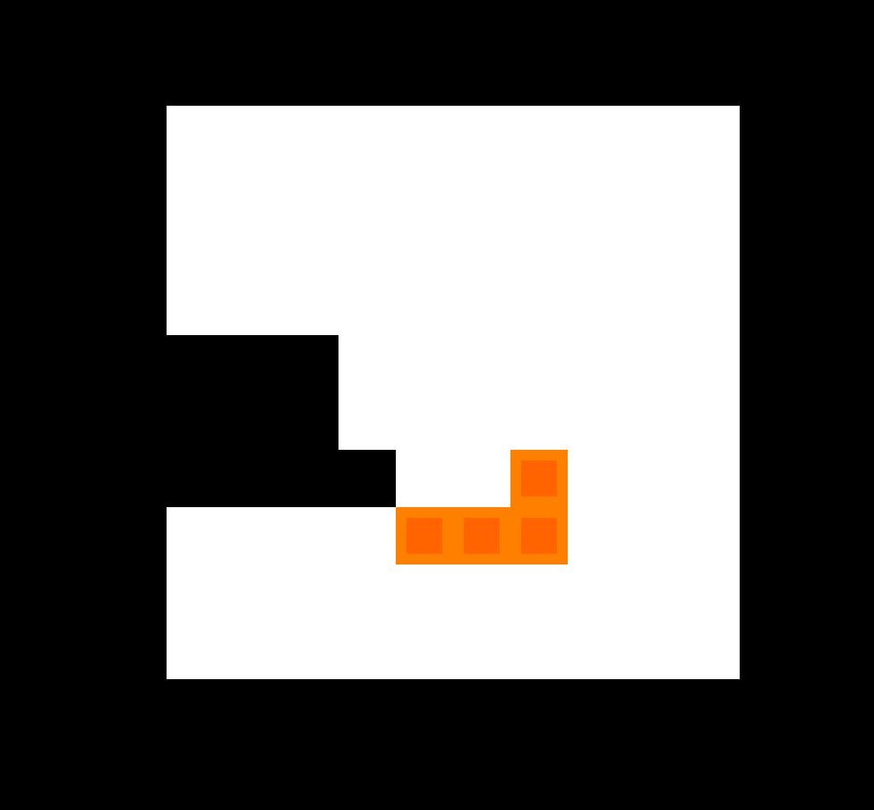

# (Rotating Tetris)

Author: (David Zelong Fan)

Design: (This is a Tetris game where you can rotate your screen but not your blocks.)

Screen Shot:

How Your Asset Pipeline Works:

All assets are located in the "Resources" folder. Because Tetris blocks all have the same shape, I stored the shape of the block and the color palette separately.

The script `preprocess.py` processes the asset and exports them to the "chunk" format. This script will read the data, convert them to chunks, and save the data into the dist folder (needs dist folder to run). Note the size of the chunk takes up 4 bytes, and the script stores them in little endian. We may need to modify the "size" portion to big endian if the game is run on a different machine.

How To Play:

Press left or right arrow to rotate the screen. Press down arrow to accelerate the game.

Just like Tetris, a row or column will disappear once it is filled.

There are no death conditions, but you can choose to give up if you can't put down any new blocks.

This game was built with [NEST](NEST.md).

